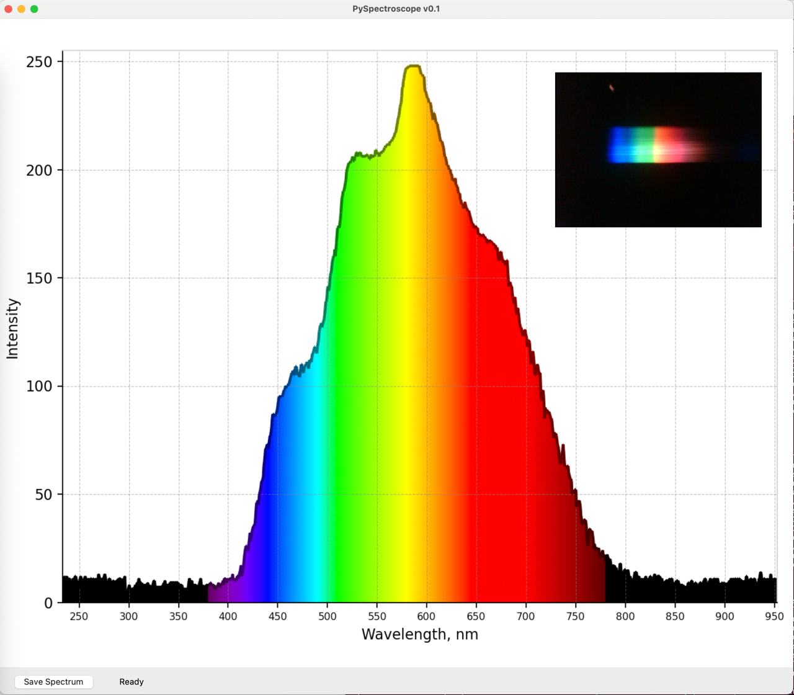
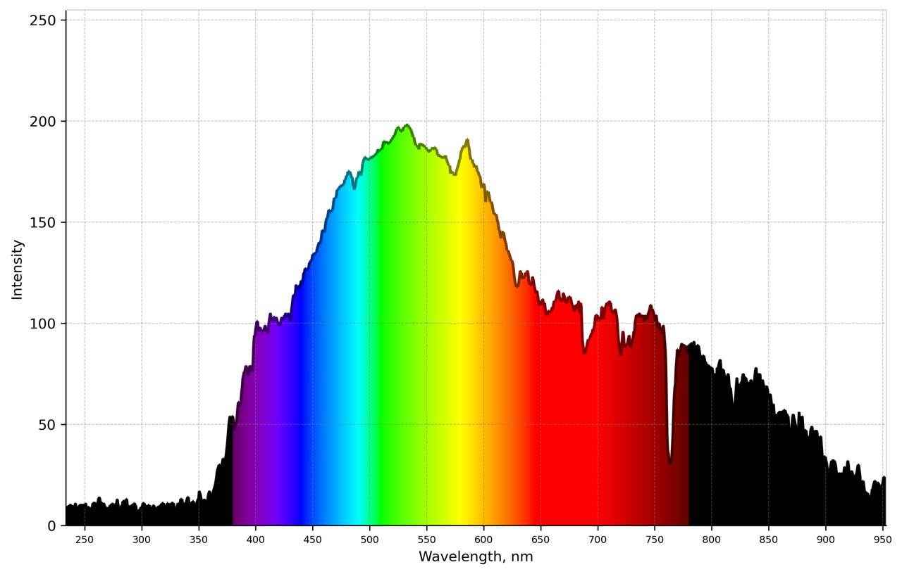
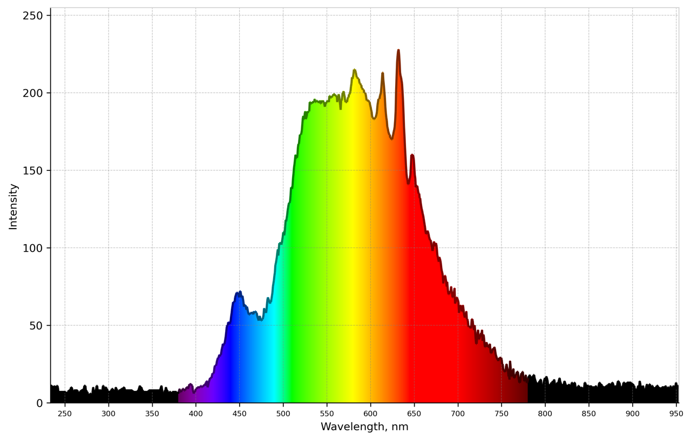

# PySpectroscope

A cross-platform Python App for a USB spectroscope.

A popular choice for a spectrometer is a Theremino app, but it works only for Windows.
This app should work on any system capable to run Tkinter, NumPy and OpenCV (Windows, OSX, Lixux, Raspberry Pi).

This project was inspired by a PySpectrometer app, which is alas, abandoned, and its last release was in 2022.

### Installation & Run
```
git clone https://github.com/dmitryelj/PySpectroscope
pip3 install -r requirements.txt
python3 spectroscope.py
```

Your spectroscope should be detectable as a USB video device. If you have several cameras, you can adjust a video_source parameter.

### UI



### Calibration 

- Open the app. 
- Get a spectrum of the fluorescent lamp (see examples), press a "Save Spectrum" button in the app. 2 image files will be saved.
- Open the saved png file in the image editor, find the x-coordinates of 2 known peaks (can be found in Wikipedia).
- Enter the coordinates into the first line of the SpectrometerApp class (see spectroscope.py)

Semi-automated calibration: not implemented yet.

### Examples

**Daylight**


**LED Lamp**


**Fluorescent Lamp**

